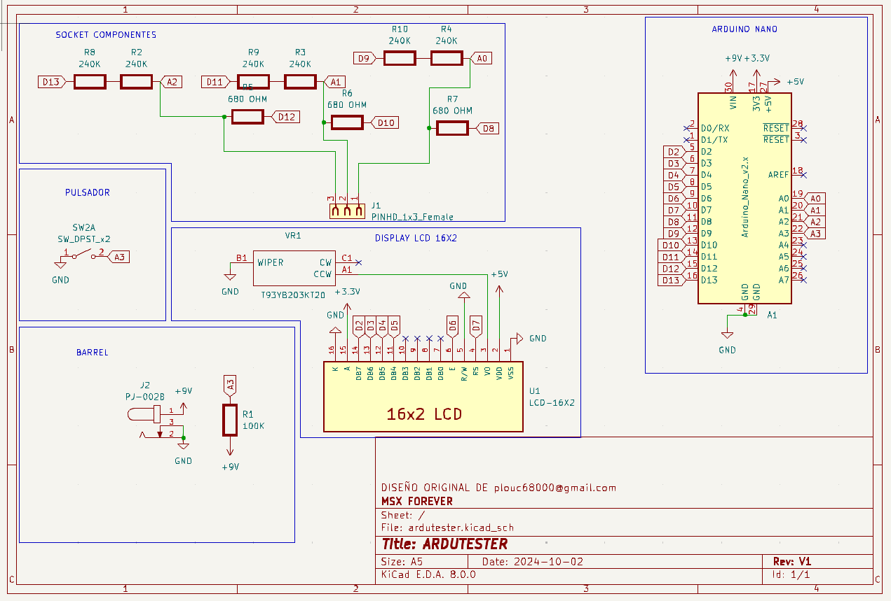

## Projecto: {Ardutester}

Un comprobador de componentes Arduino basado en https://create.arduino.cc/projecthub/plouc68000/ardutester-v1-13-the-arduino-uno-transistor-tester-dbafb4

El autor original de este proyecto es [plouc68000](https://projecthub.arduino.cc/plouc68000) quien hizo el diseño y el codigo ardutester v1.13, aquien le doy todo el agradecimiento por este proyecto para la comunidad. También se a consultado este otro link [Mundo Yakara](https://www.youtube.com/watch?v=iBbuWZ-2Ljg&t=707sNo), gracias yakara por esos grandes videos. No es un proyecto propio, pero si he diseñado la PCB y fabricado siguiendo el esquema original.

La pcb esta diseñada para ser lo más pequeña y manejable posible, se alimenta de 9v por debajo de ese voltaje podría dar malos resultados.
Se a optado por resistencias SMD 1206 1/4w por el espacio que ocupan y no siendo muy dificiles de soldar para usuario medio y se a agregado una resistencia variable de 2k, (VR1) para ajustar el contraste de la pantalla.

 

El resultado lo vemos en las siguientes imagenes.

 

## La caja 3D

Ha sido diseñada desde tinkercad es un modelo sencillo, pero agradable en tamaño y sencillez. Yo la he impreso en PLA con una boquilla 0.2, con un relleno de 20% y una altura de capa de 0.14.

 

Aquí se puede ver como queda el modelo montado.

 

## Lista de materiales

|===
|  ID        |  Part name                | Part number | Quantity |
|------------|---------------------------|-------------|----------| 
|            |  [Pin Header 1x06 2.54mm](https://es.aliexpress.com/item/32973181162.html?aff_fcid=d903680999de436089a5490bd3a816fa-1727865740130-04704-_op7nKeV&aff_fsk=_op7nKeV&aff_platform=api-new-link-generate&sk=_op7nKeV&aff_trace_key=d903680999de436089a5490bd3a816fa-1727865740130-04704-_op7nKeV&terminal_id=86576b637fb64effa68b8191e53f7e2e&afSmartRedirect=y)|             | 2        |
|  A1        | [Arduino Nano USB Mini](https://es.aliexpress.com/item/1005007066680464.html?spm=a2g0o.productlist.main.1.41e14b2blp1sxW&algo_pvid=47740690-c9e2-45f6-bfde-41709d7d3b26&algo_exp_id=47740690-c9e2-45f6-bfde-41709d7d3b26-0&pdp_npi=4%40dis%21EUR%213.13%212.95%21%21%213.38%213.19%21%40211b617a17278656318553163e50ab%2112000039294978565%21sea%21ES%21110520769%21X&curPageLogUid=RWWmlRxS1obH&utparam-url=scene%3Asearch%7Cquery_from%3A)   |             | 1        |
|  U1        | [LCD Module 16x2](https://es.aliexpress.com/item/1005002035425652.html?spm=a2g0o.order_list.order_list_main.161.1501194dUeYPXH&gatewayAdapt=glo2esp)           |             | 1        |
|R2-R4,R8-R10| [Resistor 680 Ohm SMD 1/4W](https://es.aliexpress.com/item/1005006119604970.html?aff_fcid=109ce6c0f9fc4ad7a73b245d295b5530-1727829901944-07178-_oFS8ZiH&aff_fsk=_oFS8ZiH&aff_platform=api-new-link-generate&sk=_oFS8ZiH&aff_trace_key=109ce6c0f9fc4ad7a73b245d295b5530-1727829901944-07178-_oFS8ZiH&terminal_id=86576b637fb64effa68b8191e53f7e2e&afSmartRedirect=y) |             | 3        |
|R5-R7       | [Resistor 240 kOhm SMD 1/4W](https://es.aliexpress.com/item/1005006119604970.html?aff_fcid=109ce6c0f9fc4ad7a73b245d295b5530-1727829901944-07178-_oFS8ZiH&aff_fsk=_oFS8ZiH&aff_platform=api-new-link-generate&sk=_oFS8ZiH&aff_trace_key=109ce6c0f9fc4ad7a73b245d295b5530-1727829901944-07178-_oFS8ZiH&terminal_id=86576b637fb64effa68b8191e53f7e2e&afSmartRedirect=y)|             | 6        |
|  R1        | [Resistor 100 kOhm SMD 1/4W](https://es.aliexpress.com/item/1005006119604970.html?aff_fcid=109ce6c0f9fc4ad7a73b245d295b5530-1727829901944-07178-_oFS8ZiH&aff_fsk=_oFS8ZiH&aff_platform=api-new-link-generate&sk=_oFS8ZiH&aff_trace_key=109ce6c0f9fc4ad7a73b245d295b5530-1727829901944-07178-_oFS8ZiH&terminal_id=86576b637fb64effa68b8191e53f7e2e&afSmartRedirect=y)|             | 1        |
|  VR1       | [Pot. 2 khm])(https://www.mouser.es/ProductDetail/Vishay-Sfernice/T93YB202KT20?qs=QKF3unAkNR%252BlfAchrMW0cA%3D%3D) y tambien [aquí*](https://es.aliexpress.com/item/1005005912140839.html?spm=a2g0o.productlist.main.51.751e21b7TW73LU&algo_pvid=7abf3d14-b5a7-4dfd-8cf9-4a311f1f67ae&algo_exp_id=7abf3d14-b5a7-4dfd-8cf9-4a311f1f67ae-25&pdp_npi=4%40dis%21EUR%211.55%211.38%21%21%2111.79%2110.49%21%40211b617b17278285841511484e111d%2112000034816989746%21sea%21ES%21110520769%21X&curPageLogUid=toDMphzF2Zoc&utparam-url=scene%3Asearch%7Cquery_from%3A)             | T93YB 200K  | 1        | 
|  SW        | [Test Button](https://es.aliexpress.com/item/1703067548.html?aff_fcid=fafa71da58ec4b25b63fa63f5b75399c-1727865206917-02348-_oBVFEtF&aff_fsk=_oBVFEtF&aff_platform=api-new-link-generate&sk=_oBVFEtF&aff_trace_key=fafa71da58ec4b25b63fa63f5b75399c-1727865206917-02348-_oBVFEtF&terminal_id=86576b637fb64effa68b8191e53f7e2e&afSmartRedirect=y)               |TL2230EEF100 | 1        |
|  J2        | [Barrel](https://es.aliexpress.com/item/32974707992.html?spm=a2g0o.order_list.order_list_main.1072.1501194dUeYPXH&gatewayAdapt=glo2esp)                    |   PJ-002B   | 1        |          
|  J1        | [Pin Socket 1x03 2.54mm](https://es.aliexpress.com/item/4001198421663.html?spm=a2g0o.productlist.main.3.54dc1516CoQb6N&algo_pvid=d2288737-30ab-41a3-969c-2ecb81ce213b&algo_exp_id=d2288737-30ab-41a3-969c-2ecb81ce213b-1&pdp_npi=4%40dis%21EUR%211.50%211.47%21%21%211.63%211.60%21%4021038e6617278282349552791e3437%2110000015275671645%21sea%21ES%21110520769%21X&curPageLogUid=Br6Yq0f0jhEw&utparam-url=scene%3Asearch%7Cquery_from%3A)    |             | 1        |

*Las medidas deben ser iguales pero no lo aseguro.

## Paso 1: Instalación

1. Abre el archivo de arduino ArduTester_1_13.ino.
2. Conecta el arduino nano y elige puerto correcto.
3. Clica sobre la  y espera a que cargue el codigo, una vez cargado ya puedes retirar el arduino y cerrar el programa.

## Paso 2: Montaje de componentes en la PCB

=== License
This project is released under a {OSHW} License.

=== Contributing
To contribute to this project please contact plouc68000 <plouc68000@gmail.com>

=== Help
This document is written in the _AsciiDoc_ format, a markup language to describe documents. 
If you need help you can search the http://www.methods.co.nz/asciidoc[AsciiDoc homepage]
or consult the http://powerman.name/doc/asciidoc[AsciiDoc cheatsheet]
